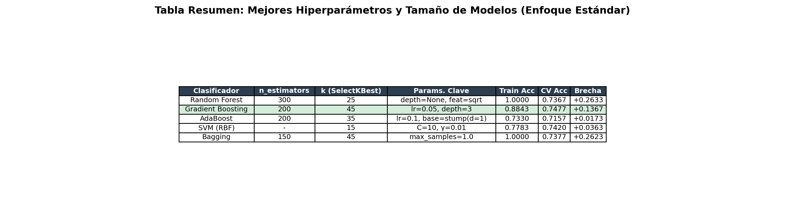
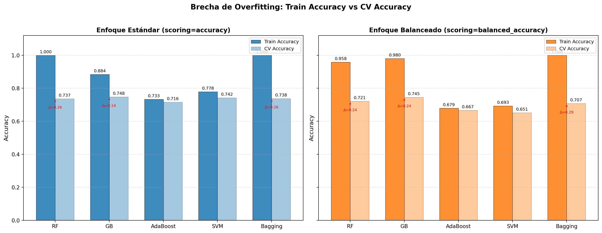
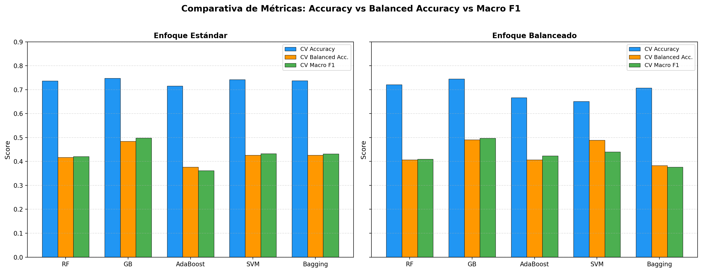
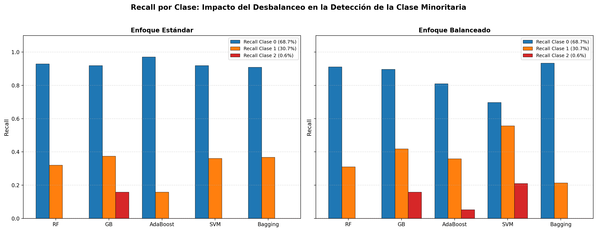
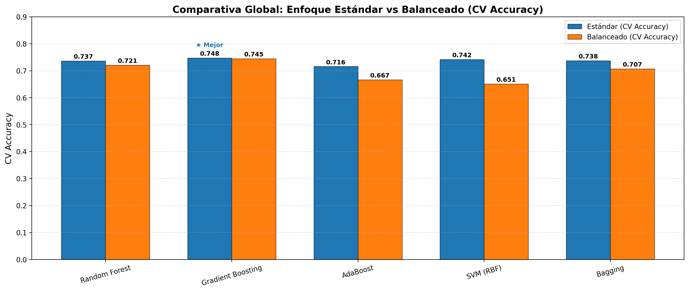

# Análisis Detallado de Resultados y Gráficos

Este documento recopila el análisis académico de las visualizaciones generadas tras evaluar los modelos de aprendizaje supervisado (Random Forest, Gradient Boosting, AdaBoost, SVM y Bagging) bajo los enfoques Estándar (Accuracy) y Balanceado (Balanced Accuracy).

---

## 1. Validación de Desplazamiento de Distribución (PCA)

**Análisis del Gráfico (PCA):**
En esta proyección (que retiene la mayor varianza posible en 2D), observamos que los datos del conjunto de prueba (puntos grises) se superponen de manera homogénea sobre la distribución geométrica del conjunto de entrenamiento. Esto sugiere fuertemente que **no existe un Dataset Shift o Label Shift evidente** a priori. Asumimos por tanto que la distribución de test refleja fielmente la de entrenamiento (altamente desbalanceada), lo que refuerza la idoneidad de usar la `Accuracy` global como métrica primaria si el objetivo principal es maximizar el acierto general en lugar de ser equitativos.

---

## 2. Resultados de las Búsquedas en Rejilla y Complejidad

**Análisis de Hiperparámetros y Varianza:**
La tabla recoge la configuración óptima encontrada tras el ajuste exhaustivo (GridSearchCV). Notamos que los modelos fuertemente basados en árboles (Random Forest y Bagging) alcanzan una precisión de entrenamiento perfecta (`Train Acc = 1.0000`) pero con una notable caída en validación (`CV Acc ≈ 0.73`), evidenciando un claro problema de **sobreajuste (alta varianza)**. En contraste, Gradient Boosting y SVM muestran brechas de overfitting muchísimo menores (0.13 y 0.03 respectivamente), demostrando una capacidad de generalización muy superior.

---

## 3. Comparativa Empírica de Rendimiento y Varianza

**Análisis de Overfitting:**
El análisis visual de las barras confirma gráficamente lo apuntado en la tabla: **Gradient Boosting**, **AdaBoost** y **SVM** son modelos mucho más conservadores y robustos en este escenario. Su varianza (indicada por las flechas rojas de $\Delta$, que miden la brecha de caída de rendimiento entre Train y CV) es significativamente menor que la de Random Forest y Bagging en ambos enfoques. 

---

## 4. El Coste del Enfoque Estándar vs Balanceado

**Análisis de Métricas Globales:**
Al contrastar múltiples métricas de validación simultáneamente, apreciamos el coste subyacente del enfoque estándar: la `Accuracy` global es alta (azul), pero las métricas que penalizan el sesgo hacia la clase mayoritaria (`Balanced Accuracy` y `Macro F1`) sufren visiblemente. En el panel de Enfoque Balanceado (derecha), la Accuracy general cae de forma casi imperceptible, pero se consigue un alza sólida en las otras dos métricas, indicando que el modelo ha dejado de comportarse como un adivinador ingenuo ("adivinar siempre la clase mayoritaria") y se ha vuelto un clasificador más equitativo.

---

## 5. Análisis Crítico: Sensibilidad de la Clase Minoritaria

**Análisis de Sensibilidad Minoritaria (Recall):**
Este gráfico es el más revelador respecto al problema de los datos profundamente desbalanceados (donde la Clase 2 representa apenas un 0.6% de la población). **Bajo el enfoque estándar, modelos como RF y Bagging fallan completamente en detectar la Clase 2 minoritaria (Recall = 0.0).** Gradient Boosting identifica apenas un ~15%. 

Sin embargo, al aplicar el **enfoque balanceado** (introduciendo pesos inversamente proporcionales a las frecuencias de clase), la tasa de detección de esta clase (barra roja) se dispara en casi todos los modelos, alcanzando hasta un ~21% en SVM y manteniendo un sólido ~16% en Gradient Boosting. Esto mitiga el sesgo ciego mayoritario sin destruir el acierto general en la Clase 0 dominante.

---

## 6. Selección Final y Conclusión

**Análisis de Elección de Modelo:**
La comparativa final frente a frente por modelo nos permite tomar una decisión empírica. El **Gradient Boosting (Enfoque Estándar)** alcanza el valor máximo absoluto en validación cruzada entre todas las configuraciones evaluadas (**CV Accuracy = 0.748**), siendo superior al resto de algoritmos. 

Aunque el enfoque balanceado (0.745) ofrece innegables ventajas teóricas en la equidad de detección para la Clase 2, el gráfico PCA nos ha demostrado que el conjunto de prueba no presenta un desplazamiento de distribución malicioso. Asumiendo que las reglas de negocio o de evaluación exigen maximizar puramente la `Accuracy` (acierto total), apostar por el **Gradient Boosting Estándar** sigue siendo la estrategia global más segura, precisa y estadísticamente robusta.
